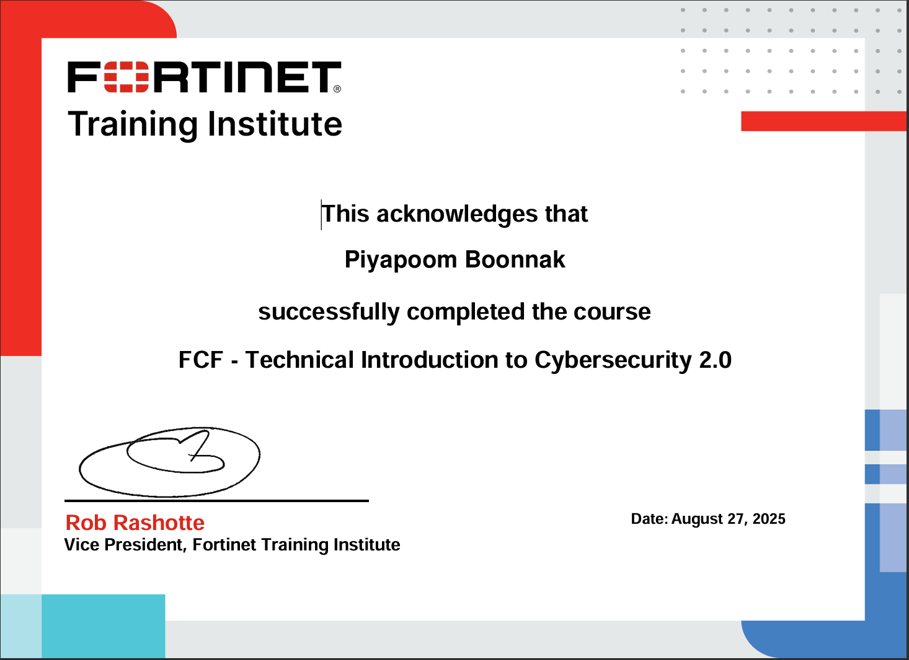
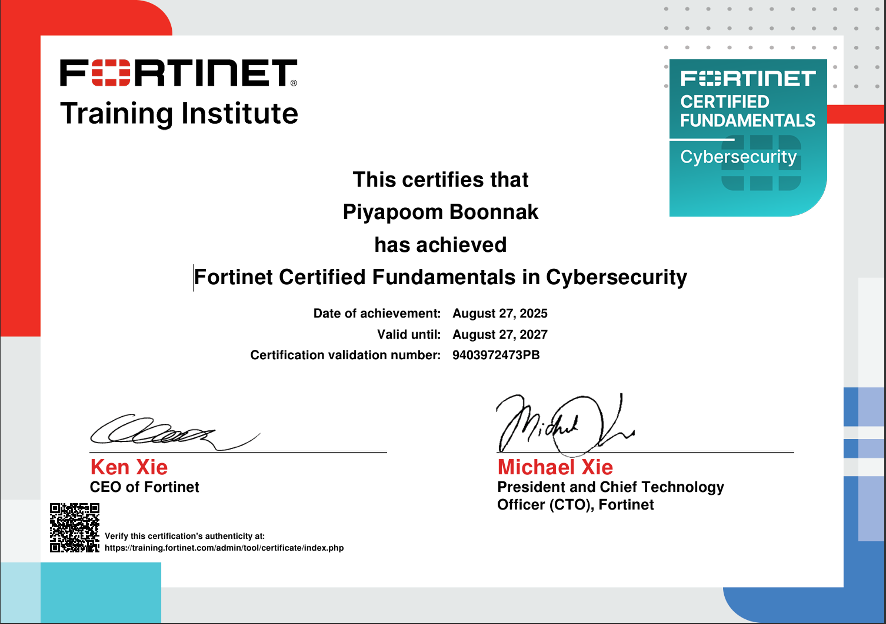

# Certification

### Certificate1
#### Certificate of Completion MOOC for The Accomplishment of The Basic Cybersecurity

### Certificate2
#### Fortinet FCF-Introduction to the Threat Landscape 3.0

### Certificate3
#### Fortinet FCF-Getting Started in Cybersecurity 3.0

### Certificate4
#### Fortinet FCF-Thecnical Introduction to Cybersecurity 2.0

### Certificate5
#### Fortinet Certified Fundamentals in Cybersecurity

