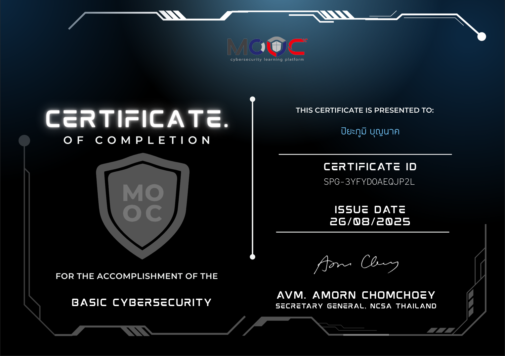

# Certification

### Certificate1
#### Certificate of Completion MOOC for The Accomplishment of The Basic Cybersecurity

### Certificate2
#### Fortinet FCF - Introduction to the Threat Landscape 3.0

### Certificate3
#### Fortinet FCF - Getting Started in Cybersecurity 3.0

### Certificate4
#### Fortinet FCF - Thecnical Introduction to Cybersecurity 2.0

### Certificate5
#### Fortinet Certified Fundamentals in Cybersecurity

### Certificate6
#### IC3 GS6 Level 1

### Certificate7
#### Fortinet FCA - FortiGate 7.6 Operator Self-Paced

### Certificate8
#### Fortinet Certified Association in Cybersecurity

### Certificate9
#### ARIT Digital Literacy Certification

### Certificate10
#### Introduction to Cybersecurity certificate

